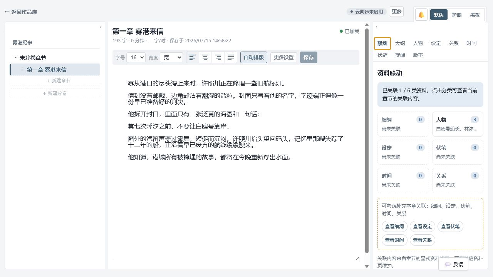
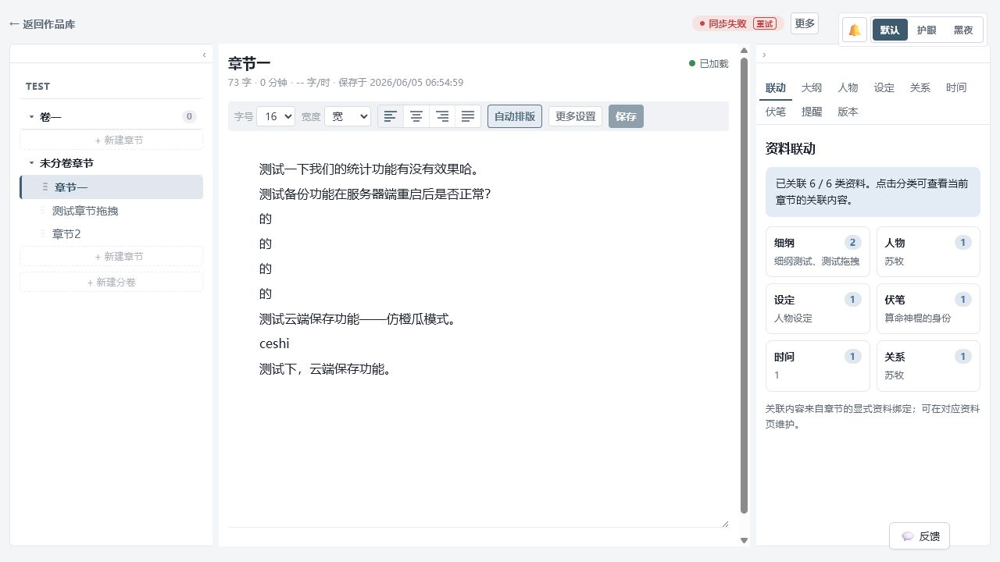

# 章枢写作可靠性闭环测试报告

## 1. 基本信息

| 项目 | 内容 |
| --- | --- |
| 测试日期 | 2026-07-16 |
| 测试范围 | 写作工作区的资料联动与资料切换可靠性 |
| 执行方式 | 本地启动 FastAPI（`127.0.0.1:8000`）与 Vite（`127.0.0.1:5180`），通过应用内浏览器逐项手工验证 |
| 数据保护策略 | 仅读取已有项目资料；不新建、修改或删除用户的小说内容、资料或版本 |
| 通过标准 | 每一项均完成预期交互、页面无可见错误、资料显示仅来自当前章节的显式绑定 |
| 测试数据 | `雾港纪事 / 第一章 雾港来信`（1/6 类关联）与 `TEST / 章节一`（6/6 类关联） |

## 2. 测试用例与执行结果

| 编号 | 场景 | 操作步骤 | 预期结果 | 状态 | 实际结果 |
| --- | --- | --- | --- | --- | --- |
| WRL-01 | 启动与工作区可达 | 启动本地服务，进入两个已有章节的写作工作区。 | 页面在有限时间内加载；编辑器与右侧资料栏可用。 | 通过 | 两个 HTTP 健康检查均为 200；两个项目均加载了章节正文、编辑器和资料栏。 |
| WRL-02 | 联动默认入口 | 打开未恢复历史页签的 `TEST` 项目，再选择“章节一”。 | 右侧默认显示“联动”；展示细纲、人物、设定、伏笔、时间、关系六类卡片。 | 通过 | 未选章节时已显示“资料联动”；选择章节后保持“联动”，完整显示六类卡片。已有历史页签时会优先恢复用户上次选择，这是预期行为。 |
| WRL-03 | 联动摘要准确性 | 记录各卡片数量和名称，分别打开详情核对。 | 数量与当前章节资料一致；名称摘要不显示跨章节的无关资料。 | 通过 | `TEST / 章节一` 摘要为细纲 2、人物 1、设定 1、伏笔 1、时间 1、关系 1；逐项进入详情后均与摘要名称、数量相符。 |
| WRL-04 | 普通资料切换 | 依次点击细纲、人物、设定、伏笔卡片。 | 跳转至对应右侧页签；显示本章关联资料或清晰的空状态；无报错。 | 通过 | 分别显示“细纲测试 / 测试拖拽”、“苏牧”、“人物设定”、“算命神棍的身份”；切换过程无可见错误。 |
| WRL-05 | 缺失关联提示 | 使用仅关联人物的 `雾港纪事 / 第一章 雾港来信`，点击缺失细纲卡片。 | 显示“尚未关联”及补充提醒；可进入对应页签，且不会误显示其他章节资料。 | 通过 | 概览显示 1/6 类关联和五类补充提示；进入细纲、设定、伏笔后均为本章明确空状态，未显示无关资料。 |
| WRL-06 | 时间线联动详情 | 打开“时间”页签，核对事件、前后节点和跨事件关系。 | 仅显示当前章节显式关联的时间线信息；空数据时显示明确空状态。 | 通过 | `TEST / 章节一` 显示 1 个事件、1 个前后节点和 2 条相关连接；`雾港纪事` 的无数据分支显示明确空状态。 |
| WRL-07 | 关系图联动详情 | 打开“关系”页签，核对节点与直接关系。 | 仅展示由本章显式绑定资料导出的关系节点和边；空数据时显示明确空状态。 | 通过 | `TEST / 章节一` 显示核心节点“苏牧”1 个、直接关系 2 条、关联节点 2 个；`雾港纪事` 的无数据分支显示明确空状态。 |
| WRL-08 | 工作区状态恢复 | 切换至“时间”，刷新写作页面，再切回“联动”。 | 最近选择的资料页签保持；切回“联动”后摘要仍可正常加载。 | 通过 | `雾港纪事` 刷新后恢复“时间”，时间线完成加载；随后切回“联动”后 1/6 摘要正常重新加载。 |
| WRL-09 | 构建回归 | 执行前端生产构建（含类型检查）。 | TypeScript 校验与 Vite 构建成功。 | 已通过 | `npm run build` 于本轮功能实现后通过；仅有既有包体大小提示。 |

## 3. 证据与截图

截图仅包含应用内浏览器的章枢页面。

### 3.1 部分关联与缺失提示

### 3.2 六类资料完整关联

## 4. 运行质量检查

- 在资料卡片切换、关系图、时间线、刷新恢复后读取浏览器控制台：`error` 为 0 条。
- `TEST` 项目出现既有的“登录已过期，云同步失败”提示；本机章节、资料联动与本轮测试均未受影响。本轮未重试登录或修改云同步状态。
- Vite 生产构建给出单个前端 chunk 大于 500 kB 的提示；不影响本次功能正确性，建议后续单独规划代码分包。

## 5. 执行结论

**资料联动闭环：通过，可进入下一阶段。**

已验证的闭环为：打开写作工作区 → 查看章节关联总览 → 从卡片进入六类详情 → 识别缺失关联 → 查看时间线和关系图的显式绑定结果 → 刷新恢复当前工作区状态 → 返回联动总览。全程未修改用户小说正文、资料或版本。

## 6. 已知限制

- 本轮不改动用户原有小说数据，因此不覆盖“编辑正文后保存、版本创建与恢复”的写入型流程。
- “资料联动”以章节的显式资料绑定为准；不会基于名称或 AI 推断自动关联资料。
